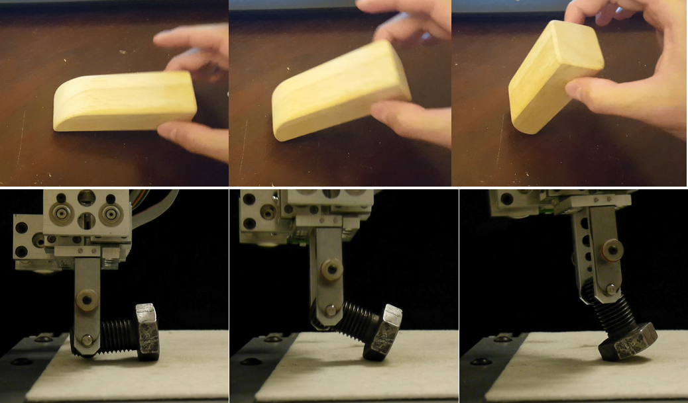
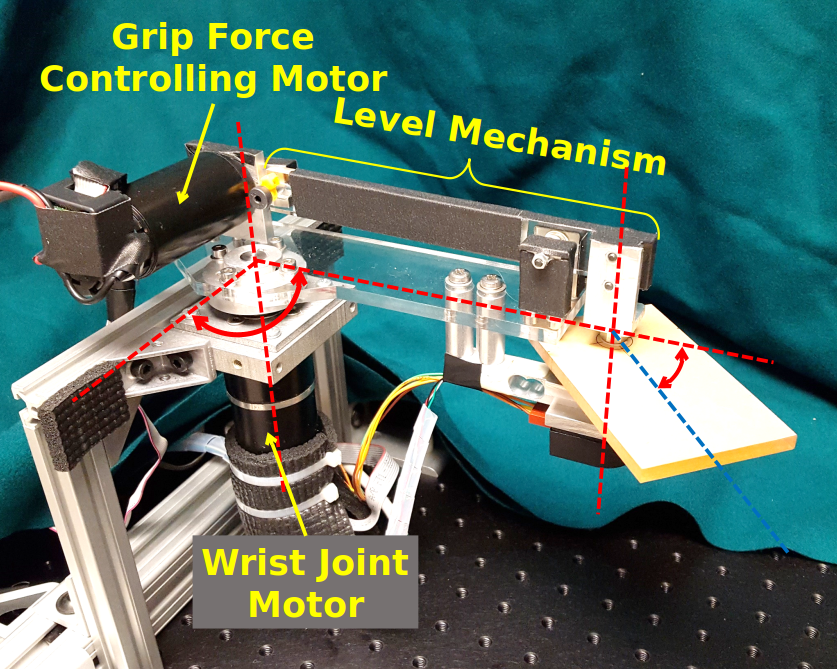
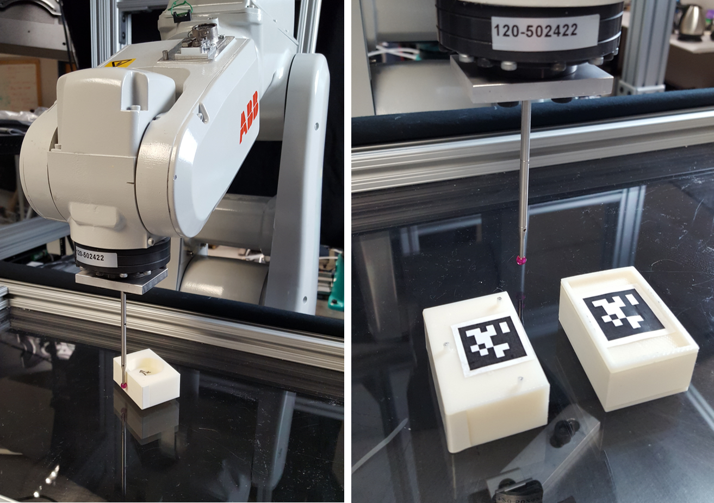

### Hybrid Servoing: Reliable Manipulation under External Contacts [(Project Page)](http://localhost:4000/hexo-theme-huxblog/project_hybrid_servoing/)

  <div-left>  
    <!--  -->
  </div-left>
  <div-right> Human manipulation dexterity benefits a lot from utilizing external contacts. However, it is still hard for a robot to safely and reliably use external contacts. A small error or disturbance in the system can cause the robot to crash, or the desired contact mode to break.

  We believe a proper use of compliant control is the key to success. Being compliant (using force control) in suitable directions could avoid over-constraining and maintain desired contacts. Being rigid (velocity/position control) in other directions can keep the disturbance rejection ability for executing the motion plan.
  

    <ptitle> Manipulation with Suction Cups using External Contacts </ptitle>
    <authors> Xianyi Cheng, </authors> <authorsb> Yifan Hou </authorsb> <authors> and Matthew T. Mason </authors>
    <conf> 2019 International Symposium on Robotics Research (ISRR) </conf>
    <a href="https://xianyicheng.github.io/files/cheng_isrr19.pdf">Paper</a> · <a href="https://www.youtube.com/watch?v=eK77vK8wkUE&feature=emb_logo"> Video </a>
  
  

    <ptitle> Criteria for Maintaining Desired Contacts for Quasi-Static Systems </ptitle>
    <authorsb> Yifan Hou </authorsb> <authors> and Matthew T. Mason </authors>
    <conf> In Proceedings of 2019 International Conference on Intelligent Robots and Systems (IROS) </conf>
    <a href="https://www.ri.cmu.edu/publications/criteria-for-maintaining-desired-contacts-for-quasi-static-systems/">Paper</a>
  
 

    <ptitle> Robust Execution of Contact-Rich Motion Plans by Hybrid Force-Velocity Control </ptitle>
    <authorsb> Yifan Hou </authorsb> <authors> and Matthew T. Mason </authors>
    <conf> In Proceedings of 2019 IEEE International Conference on Robotics and Automation (ICRA) </conf>
    <a href="https://www.ri.cmu.edu/publications/robust-execution-of-contact-rich-motion-plans-by-hybrid-force-velocity-control/">Paper</a> · <a href="https://www.youtube.com/watch?v=KtSNmvwOenM&feature=emb_logo"> Video </a>
  

  </div-right>

### Reorienting Objects of Any Shapes between Any 3D Poses [(Project Page)](http://localhost:4000/hexo-theme-huxblog/project_reorienting/)

  <div-left> 
  </div-left>
  <div-right> We consider the problem of reorienting a rigid object with arbitrary known shape on a table using a two-finger pinch gripper. Reorienting problem is challenging because of its non-smoothness and high dimensionality. In this work, we focus on solving reorienting using pivoting, in which we allow the grasped object to rotate between fingers. Pivoting decouples the gripper rotation from the object motion, making it possible to reorient an object under strict robot workspace constraints.
    

      <ptitle> Fast Planning for 3D Any-Pose-Re-orienting using Pivoting </ptitle>
      <authorsb> Yifan Hou</authorsb> <authors>, Zhenzhong Jia and Matthew T. Mason </authors>
      <conf> In Proceedings of 2018 IEEE International Conference on Robotics and Automation (ICRA) </conf>
      <a href="https://www.ri.cmu.edu/publications/fast-planning-3d-pose-reorienting-using-pivoting/">Paper</a> · <a href="https://www.youtube.com/watch?v=f-3NjMDZCLw&feature=emb_logo"> Video </a>
    

  </div-right>

### Planar Pivoting Regrasping with Inertial Force

  <div-left> 
  </div-left>
  <div-right> We investigate the planar dynamic pivoting problem, in which a pinched object is reoriented to a desired pose through wrist swing motion and grip force regulation. Traditional approaches based on friction compensation do not work well for this problem, as we observe the torsional friction at the contact has large uncertainties during pivoting. In addition, the discontinuities of friction and the lower bound constraint on the grip force all make dynamic pivoting a challenging task for robots. To address these problems, we propose a robust control strategy that directly uses friction as a key input for dynamic pivoting, and show that active friction control by regulating the grip force significantly improves system stability.
    

      <ptitle> Robust Planar Dynamic Pivoting by Regulating Inertial and Grip Forces </ptitle>
      <authorsb> Yifan Hou </authorsb>
      <conf> Master's Thesis, Robotics Institute, Carnegie Mellon University, May, 2017 </conf>
      <a href="https://www.ri.cmu.edu/publications/robust-planar-dynamic-pivoting-by-regulating-inertial-and-grip-forces/">Paper</a>
    
 

      <ptitle> Robust Planar Dynamic Pivoting by Regulating Inertial and Grip Forces </ptitle>
      <authorsb> Yifan Hou</authorsb> <authors>, Zhenzhong Jia and Matthew T. Mason </authors>
      <conf> 2016, The 12th International Workshop on the Algorithmic Foundations of Robotics (WAFR) </conf>
      <a href="https://www.ri.cmu.edu/publications/robust-planar-dynamic-pivoting-by-regulating-inertial-and-grip-forces-2/">Paper</a> · <a href="https://www.youtube.com/watch?v=a50qqSN4Vso&feature=emb_logo"> Video </a>
    

  </div-right>

### Closed-loop Pushing on Unknown Planar Surface

  <div-left> 
  </div-left>
  <div-right> We propose a framework for performing single contact point planar pushing with unknown pressure distribution. The problem is challenging due to the stochastic and under-actuated system properties. Using as few as two data points, our method can estimate the control-related model parameters. To achieve posture stabilization, we use differential dynamic programming and re-plan with updated model when large deviation occurs. We demonstrate empirical success in posture stabilization and robustness with respect to different pressure distributions.
    

      <ptitle> Pushing revisited: Differential flatness, trajectory planning, and stabilization </ptitle>
      <authors> Jiaji Zhou, </authors> <authorsb> Yifan Hou</authorsb> <authors> and Matthew T. Mason </authors>
      <conf> The International Journal of Robotics Research, October 2019 </conf>
      <a href="https://journals.sagepub.com/doi/10.1177/0278364919872532">Paper</a>
    

  </div-right>

